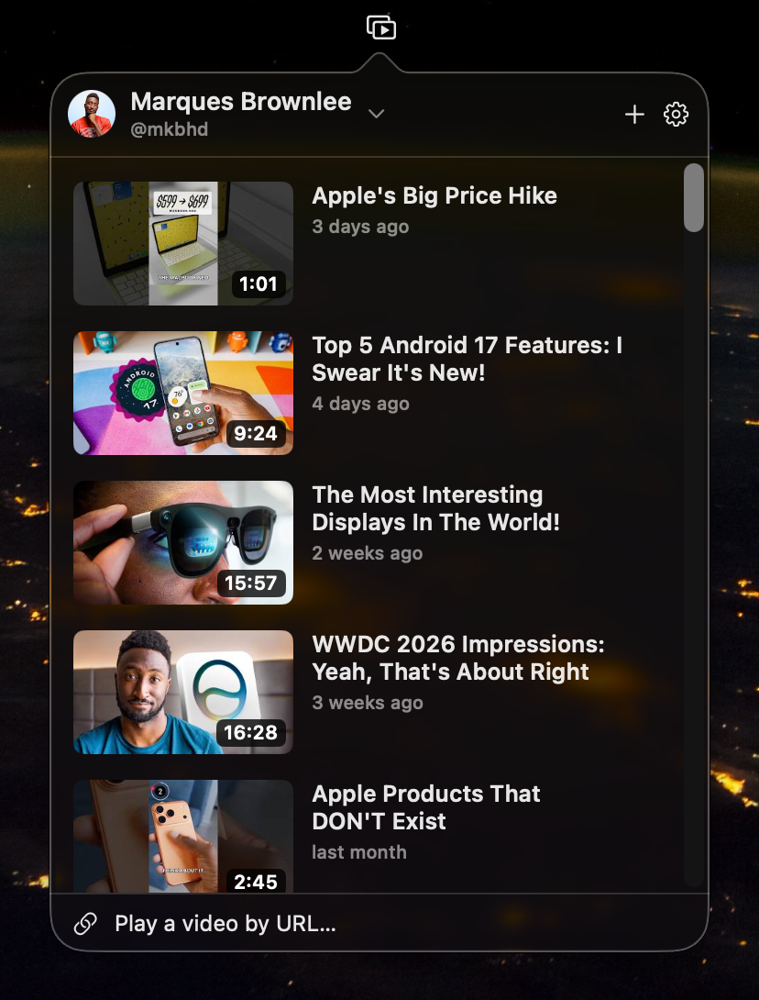
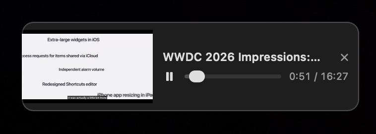

# Cranny

> [!WARNING]
> Cranny is still in active development. Things will change, break, or behave oddly without notice. Expect rough edges, and use it at your own risk.

Cranny is a tiny macOS menu-bar app that browses a YouTube channel's uploads and plays a video in a small, always-on-top window you can tuck into a corner of your screen. It is open source and native.

The name comes from "nook and cranny": a little player that sits in a corner and stays out of the way.

<div align="center">
  <table>
    <tr>
      <td align="center"><br><sub>Browse a channel from the menu bar</sub></td>
      <td align="center"><br><sub>Play in a floating corner window</sub></td>
    </tr>
  </table>
</div>

## What it does

Add one or more YouTube channels and Cranny lists their uploads newest first, with thumbnails, titles, durations, and dates. Click a video and it plays in a small floating window. At rest that window looks like a compact audio player with a tiny live video next to it. Hover it and it grows into a full 16:9 frame with YouTube's own controls, then shrinks back when you move away.

The player stays above your other windows, follows you across Spaces, floats over fullscreen apps, and never steals keyboard focus from whatever you are working in. You can also paste a video link to play it directly, without adding its channel.

## Requirements

- macOS 14 (Sonoma) or later
- Xcode 16 or later and [XcodeGen](https://github.com/yonaskolb/XcodeGen) to build from source
- Your own YouTube Data API key (free, see below)

## Build from source

```sh
brew install xcodegen
xcodegen generate
open Cranny.xcodeproj
```

Then build and run with Cmd-R. The `.xcodeproj` is generated from `project.yml` and is git-ignored, so run `xcodegen generate` again whenever you add or remove a source file.

## Get a free API key

Cranny ships no API key. A key committed to a public repo gets scraped and abused within hours, so each person brings their own.

1. Open the [Google Cloud Console](https://console.cloud.google.com/) and create a project, or pick one you already have.
2. Open the [YouTube Data API v3 page](https://console.cloud.google.com/apis/library/youtube.googleapis.com) and click Enable.
3. Under APIs & Services, open Credentials and create an API key.
4. Open Cranny's Settings, go to the API Key tab, and paste it.

The key is stored in your macOS Keychain. It is never bundled, logged, or sent anywhere except Google's own API. Normal use costs a handful of quota units per channel refresh, well under the free daily allowance of 10,000.

## Adding channels

In Settings under Channels, or the plus button in the popover, paste a channel's `@handle` or a `youtube.com/channel/UC...` URL. Cranny looks it up and shows a preview before you add it. Older `/c/` and `/user/` URLs are not supported, because there is no cheap way to resolve them. Open the channel on YouTube and copy its `@handle` instead.

## Privacy and attribution

Cranny only talks to Google and YouTube over HTTPS, to fetch metadata and play videos. Playback data is shared with YouTube and falls under [YouTube's Terms of Service](https://www.youtube.com/t/terms) and [Google's Privacy Policy](https://policies.google.com/privacy). API use is governed by the [YouTube API Services Terms](https://developers.google.com/youtube/terms/api-services-terms-of-service). Video and channel details are shown as the API returns them, and every video links back to its YouTube watch page.

## License

MIT. See [LICENSE](LICENSE).
